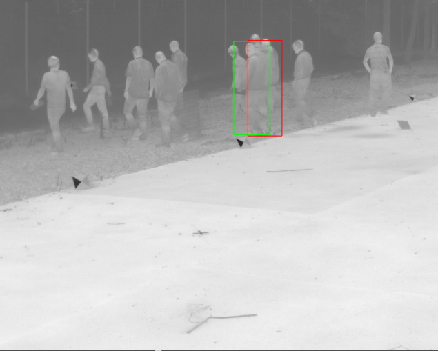
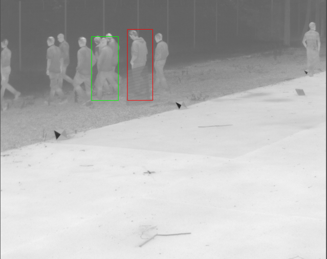
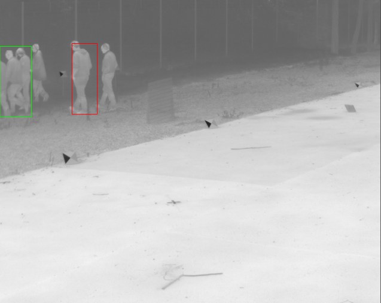
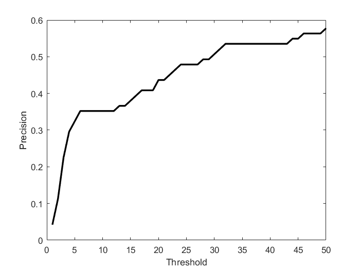
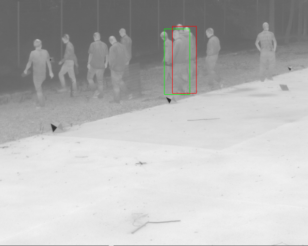
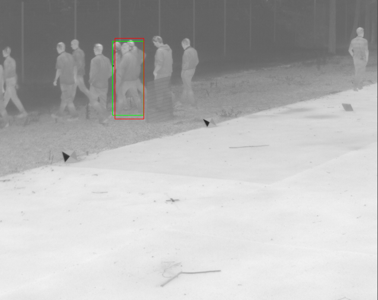
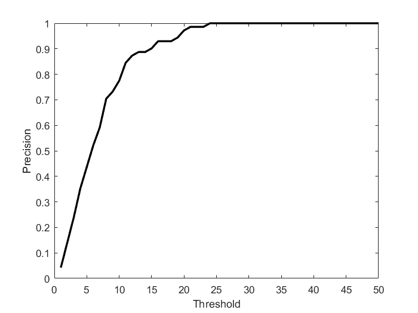

# Adapted_TIRtracking

This demo is only used for test our algorithm for adapting deep visible trackers to thermal infrared domain. Here we adopt [HCF](https://github.com/jbhuang0604/CF2) as the base tracker.

## Usage

1.Clone the repository 

```buildoutcfg
$ git clone https://github.com/xfmao/Adapted_TIRtracking.git
```

2.Download MatConvNet and extract it under the directory `.\external\matconvnet`.

Then precompile it by

```buildoutcfg
> cd <MatConvNet>
> addpath matlab
> vl_compilenn
```

If you want to run the code with GPU, make sure that you have installed CUDA and cuDNN. And compile MatConvNet with cuDNN support.(refer to http://www.vlfeat.org/matconvnet/install/)

3.Download the [VGG-Net-19](http://www.vlfeat.org/matconvnet/models/imagenet-vgg-verydeep-19.mat) model and put it in `.\model\`.

4.Run `demo.m`.

## Results

HCF without finetuning:

<figure class="third">
    
    
    
</figure>



HCF after finetuning:

<figure class="third">
    
    
    
</figure>



## Citation

```buildoutcfg
@inproceedings{Ma-ICCV-2015,
    title={Hierarchical Convolutional Features for Visual Tracking},
    Author = {Ma, Chao and Huang, Jia-Bin and Yang, Xiaokang and Yang, Ming-Hsuan},
    booktitle = {Proceedings of the IEEE International Conference on Computer Vision},
    pages={},
    Year = {2015}
}
```
